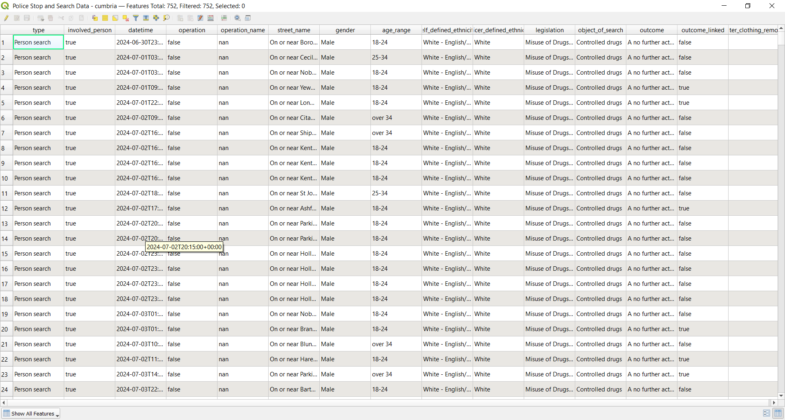
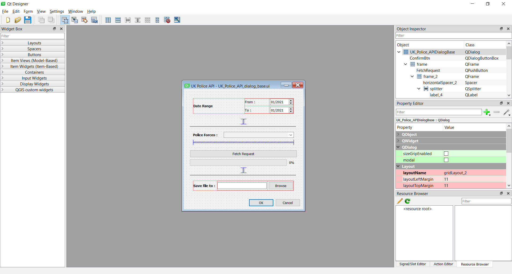

# UK Police API Plugin for QGIS

**UK Police API** is a QGIS plugin that connects to the UK Police API, allowing users to fetch and visualize stop and search data directly within QGIS.

## Features
- Fetch stop and search data from the UK Police API.
- Plot data points on a map within QGIS.
- Filter data by specific dates and forces.
- Save fetched data as a CSV file.
- Visualize data interactively in QGIS with custom attributes.

---

## How It Works

### 1. Fetching Data
- Select a date range and police forces from the plugin interface.
- Click the **Fetch Request** button to download data from the UK Police API.
- The data is saved as a CSV file in the directory you specify.

### 2. Visualizing Data
- The fetched data is plotted on the QGIS canvas as point layers.
- The plugin uses the data's latitude and longitude to plot stop and search locations.

### Screenshots / Video Demos

- How the Plugin works : 

[[Watch the demo video](https://img.youtube.com/vi/6jBTfaD5TbM/0.jpg)](https://youtu.be/6jBTfaD5TbM)

-The Fetched Data in attributes tables format :



-How the GUI was created :




---

## Installation

### QGIS Plugin Manager Installation
1. Clone this repository or download the ZIP file.
2. Extract the plugin folder (e.g., `uk_police_api`) to the following directory:
   - **Windows**: `C:/Users/<your_username>/AppData/Roaming/QGIS/QGIS3/profiles/default/python/plugins/`
   - **Linux**: `~/.local/share/QGIS/QGIS3/profiles/default/python/plugins/`
   - **Mac**: `/Users/<your_username>/Library/Application Support/QGIS/QGIS3/profiles/default/python/plugins/`
3. Restart QGIS.
4. In QGIS, go to **Plugins > Manage and Install Plugins**.
5. Enable the **UK Police API** plugin from the list.

### Manual Installation (Development)
To compile resources manually:
1. Navigate to the plugin directory.
2. Run the following command to compile the resources:
   ```bash
   pyrcc5 -o resources.py resources.qrc
